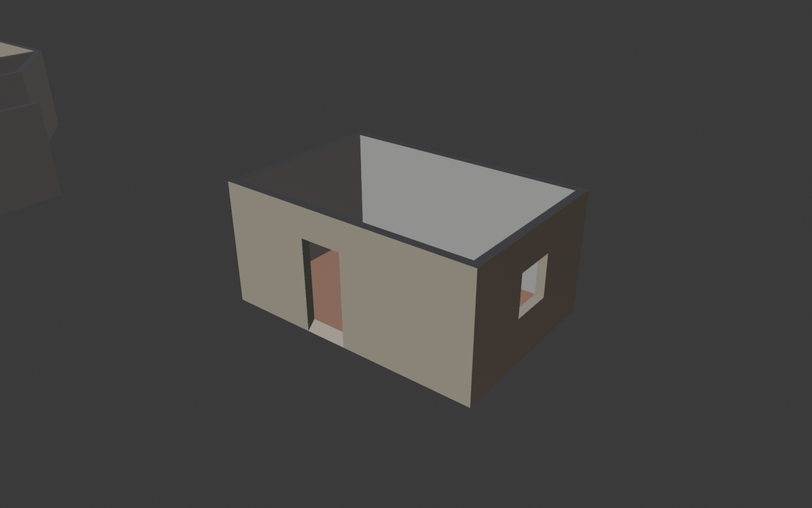

# Architectural Assembly

[](https://github.com/yohannzapata/architectural-assembly/actions/workflows/ci.yml)
[](LICENSE)


**Architectural solidify with click-to-paint surfaces for Blender.**

You model the shape: walls, gables, floors, fences, openings, anything
built from faces. Architectural Assembly gives it real thickness, with clean
corners, T-junctions and crossings. Then you paint it directly in the
viewport: pick a material and click a surface.



> **Status: early development (v0.1.0).** The core is stable and tested, but
> APIs, stored data and UI may change before 1.0.

## Features

- **Architectural solidify.** Works on any faces, not just walls. Shared edges
  are joined properly: L-corners, T-junctions, crossings, floor-to-wall, and
  any angle. The result is a closed, clean mesh.
- **Behaves like a modifier.** *Architectural Assembly* sits in the modifier
  stack with **Thickness**, **Offset** and **Miter Limit**. Edit the faces in
  Edit Mode and the thick result follows live. Apply it to bake, or delete it
  to go back.
- **Forgiving input.** Faces that touch are joined even when their vertices
  weren't merged or their edges are split differently (for example, a wall
  split for a door meeting a wall split for a window).
- **Openings for free.** Delete faces to make a door or window. The hole gets
  proper jambs, sill and lintel.
- **Windows you can just click, move and scale.** **Sidebar → Assembly →
  Windows → Add Window**, then click a wall to drop it. A window is its own
  object: **G**, **S** and **Tab** work as usual. **V** slides it along the
  walls, snapping flush to the one under the cursor (hold **Ctrl** to also
  snap to a grid on the wall),
  **Tab** edits its panes (loop cut, slide edges), **Divide Window** splits
  it quickly. It cuts every wall object it lies on and draws its own frame,
  mullions and glass. No size fields: the window is just a sheet of faces.
- **Per-face thickness.** Give selected faces their own thickness, for
  example a thicker exterior wall.
- **Click-to-paint surfaces.**
  - **Click** paints one surface (one side of a wall, a sill, a top).
  - **Shift-click** fills every connected surface of the same kind: the whole
    inside of a room in one click, without leaking outside.
  - **Ctrl-click** erases, **Alt-click** picks a material from the scene.
  - The surface under the cursor is highlighted in the paint's colour.
  - Paint is stored on the source faces, so it survives any edit or
    regeneration.
- **World-scale UVs.** Tiling textures line up across the whole building
  with no unwrapping.

## Installation

Requires **Blender 4.2 or newer**. Development and testing happen on Blender 5.2.

1. Download the repository as a ZIP (**Code → Download ZIP**) or clone it.
2. Build the extension package:
   ```bash
   blender --command extension build --source-dir architectural_assembly --output-dir dist
   ```
3. In Blender: **Edit → Preferences → Get Extensions → ⌄ → Install from Disk…**
   and pick the ZIP from `dist/`.

## Quick start

1. Model a shape out of faces, for example extrude a floor plan's edges
   upwards into wall faces. Delete faces where doors and windows go.
2. With the object selected: **Add Modifier → Architectural Assembly**, or
   **Sidebar (N) → Assembly → Add Architectural Assembly**.
3. Adjust **Thickness** and **Offset** (−1 behind the faces, 0 centred,
   +1 in front).
4. **Sidebar → Assembly → Paint**: click **Starter Paints** (or add your
   own), then **Paint Surfaces** and click away.

Face normals decide which side is *Front* and which is *Back*. Use
**Mesh → Normals → Flip** to swap them.

## How it works

The geometry engine (`architectural_assembly/core`) is plain Python with no
Blender dependency:

1. **Conform.** Weld touching vertices and split edges at T-vertices, so
   faces that touch share topology.
2. **Wedge cells.** Around every shared edge, sort the faces by angle. The
   two face sides looking into the same wedge share an output vertex, so
   L, T and X joints all fall out of one rule.
3. **Place.** Each cell's vertex is the least-squares meeting point of its
   faces' offset planes, limited by the miter limit.
4. **Close.** Rims on open edges, caps where three or more rims meet. Every
   face is tagged with its surface (front, back, top, bottom, edge) and
   source face.

The Blender layer writes that result to a hidden object. A Geometry Nodes
modifier shows it on your object. See [docs/ARCHITECTURE.md](docs/ARCHITECTURE.md).

## Roadmap

- [x] Windows that cut openings and slide along the wall (doors next)
      (`core.windows` builds on the same engine)
- [ ] Trims: baseboards, crown moulding, window frames
- [ ] Material + colour painting (tint any material with a chosen colour)
- [ ] Paint presets and a shared paint library
- [ ] Floor and roof helpers built on the same engine
- [ ] Faster regeneration for very large meshes
- [ ] Blender-in-CI smoke tests

## Development

```bash
python -m unittest discover -s tests -v   # core tests, no Blender needed
ruff check .                              # lint
```

Project layout:

```
architectural_assembly/     the Blender extension
├── core/                   pure-Python geometry (no bpy), fully unit-tested
├── assembly/               modifier, live sync, operators, sidebar UI
└── paint/                  palette and click-to-paint tool
tests/                      unit tests for core
docs/                       architecture notes and images
```

To try changes in Blender, copy or link `architectural_assembly/` into your
extensions folder (for example
`%APPDATA%\Blender Foundation\Blender\5.2\extensions\user_default\`), then
enable it in Preferences.

## License

Copyright © 2026 Yohann Joachim Zapata.

Licensed under the [GNU General Public License v3.0 or later](LICENSE),
the licence Blender requires for add-ons.
